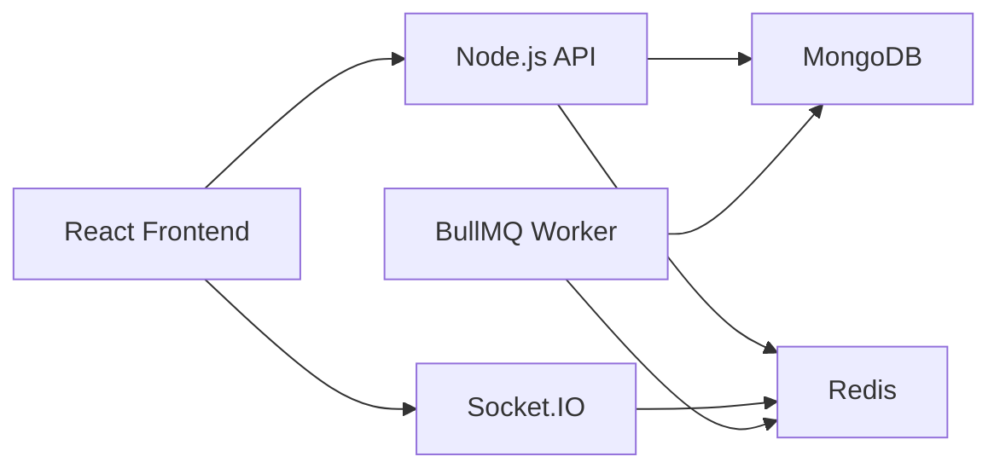
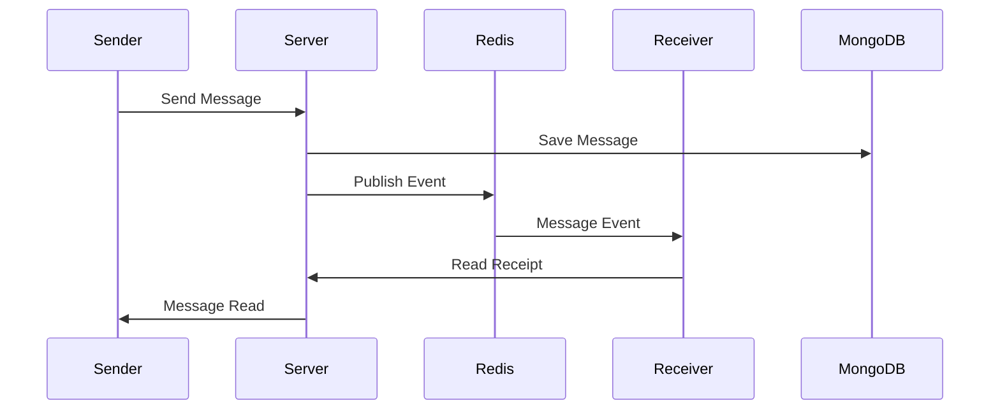
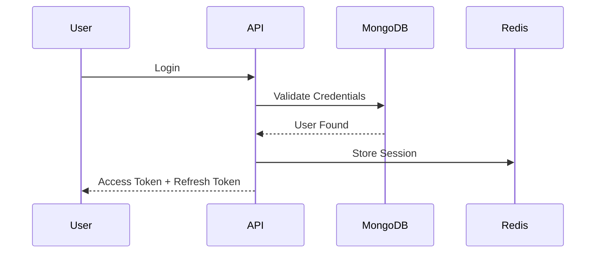
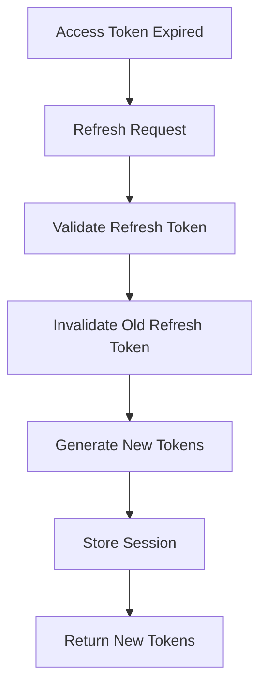
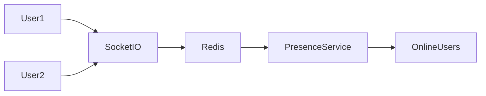
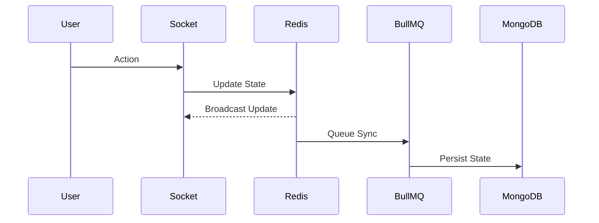

# 🚀 MyChatAppli

A production-oriented real-time messaging platform built with React, Node.js, MongoDB, Redis, Socket.IO, BullMQ, and End-to-End Encryption foundations.

---

# 📌 Overview

MyChatAppli is a modern full-stack chat platform designed to explore production-grade messaging architecture.

The project focuses on:

* Real-time messaging
* Group conversations
* Presence tracking
* Typing indicators
* Device management
* JWT authentication
* Refresh token rotation
* Redis caching
* BullMQ background jobs
* Collaborative LiveBlocks
* End-to-End Encryption foundations
* Scalable architecture patterns

---

# 🏗 System Architecture



---

# ⚡ Real-Time Messaging Flow



---

# 🔐 Authentication Flow



---

# 🔄 Refresh Token Rotation



---

# 👥 Presence System



---

# 📋 LiveBlocks Architecture

LiveBlocks provide collaborative widgets inside conversations.

Supported Widgets:

* Checklist
* Poll

Features:

* Real-time synchronization
* Optimistic concurrency control
* Redis hot cache
* BullMQ write-behind persistence
* Freeze protection
* Version tracking

---

## LiveBlocks Flow



---

# 🛠 Technology Stack

## Frontend

* React 19
* TypeScript
* Vite
* Zustand
* TanStack Query
* Socket.IO Client
* TailwindCSS
* React Hook Form
* Zod

## Backend

* Node.js
* Express.js
* MongoDB
* Mongoose
* Redis
* Socket.IO
* BullMQ
* JWT
* Winston

---

# 📂 Project Structure

```text
MyChatAppli

backend/
│
├── src/
│   ├── controllers/
│   ├── services/
│   ├── repositories/
│   ├── models/
│   ├── routes/
│   ├── middlewares/
│   ├── socket/
│   ├── config/
│   └── utils/

frontend/
│
├── src/
│   ├── app/
│   ├── assets/
│   ├── components/
│   ├── features/
│   ├── hooks/
│   ├── lib/
│   ├── services/
│   ├── store/
│   ├── styles/
│   ├── types/
│   └── utils/
```

---

# ✨ Implemented Features

## Authentication

* User Registration
* Login
* Logout
* Refresh Token Rotation
* Device Tracking
* Password Reset

## Messaging

* Private Chat
* Group Chat
* Message Editing
* Read Receipts
* Typing Indicators

## Presence

* Online Status
* Offline Status
* Real-Time Presence Updates

## LiveBlocks

* Checklist Creation
* Checklist Updates
* Poll Creation
* Voting
* Freeze State
* Version Tracking

## Security

* JWT Authentication
* Refresh Rotation
* Token Versioning
* Rate Limiting
* Input Validation
* Audit Logging

---

# 🚧 Current Roadmap

## Phase 1 ✅

* Authentication
* Messaging
* Groups
* Presence

## Phase 2 ✅

* Redis
* Socket.IO Scaling
* Device Management

## Phase 3 ✅

* LiveBlocks
* Polls
* Checklists
* BullMQ

## Phase 4 🚧

* Message Reactions
* Disappearing Messages
* Search
* Delivery Receipts

## Phase 5 🚧

* Media Sharing
* Encrypted Files
* Image Compression
* Video Uploads

## Phase 6 🚧

* Voice Calls
* Video Calls
* Screen Sharing
* WebRTC

## Phase 7 🚧

* Docker
* CI/CD
* Monitoring
* Multi-Device E2EE

---

# 🎯 Future Goals

* Signal Protocol
* Multi-Device Encryption
* Push Notifications
* WebRTC Calling
* Cloud Storage
* Kubernetes Deployment
* Horizontal Scaling

---

# 📊 Current Status

| Category          | Status |
| ----------------- | ------ |
| Authentication    | ✅      |
| Messaging         | ✅      |
| Groups            | ✅      |
| Presence          | ✅      |
| LiveBlocks        | ✅      |
| Polls             | ✅      |
| Checklists        | ✅      |
| Redis             | ✅      |
| BullMQ            | ✅      |
| Media Sharing     | 🚧     |
| WebRTC            | 🚧     |
| Multi Device E2EE | 🚧     |
| CI/CD             | 🚧     |

---

# 👨‍💻 Author

Prem Sai

Built as a production-focused real-time communication platform for learning scalable system design, distributed systems, security, and collaborative real-time applications.
